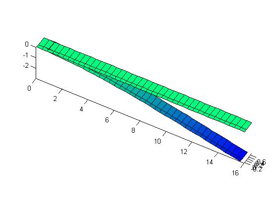
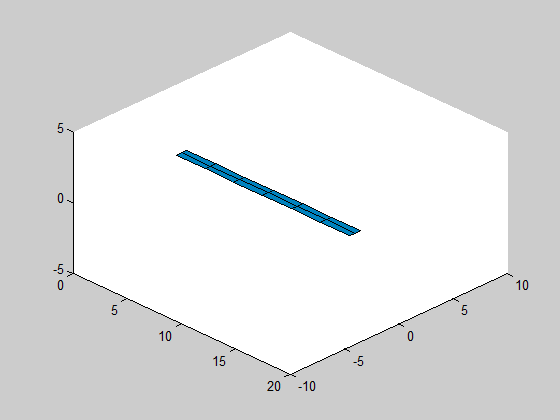
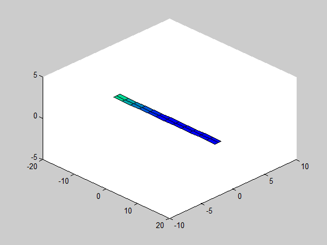

Examples
==========

Here you will find several example problems that can be analyzed with AeroFlex.

Example 1 - Structural Dynamics only
----

You can check this example [here](./example1/README.md). It uses a flexible beam
and performs the following tasks:

* find modal frequencies and modal shapes;
* compute equilibrium condition (due to gravity only);
* structural dynamics simulation;

Example 2 - Linear and nonlinear Aeroelasticity
----

You can check this example [here](./example2/README.md):
* The same flexible beam of example 1 is studied, by including aerodynamics;
* Flutter speed is found taking into account the nonlinear structural displacements
and compared againt linear case;
* Simulations of the wing under different conditions (above or under flutter speed) is performed;

Example 3 - Aileron reversals study
----

You can check this example [here](./example3/README.md).

* including a second (semi) wing;
* how to include aerodynamic control surfaces to the airplane object;
* simulations to show how aileron reversals can appear when using flexible airplane (compare with K = very large)

Example 4 - Flight dynamics of flexible flying wing
----

You can check this example [here](./example4/README.md).

* include full rigid body degrees of freedom;
* find flight conditions equilibrium;
* simulation of a flight condition  and compare against rigid body motion;

Example 5 - Stability of flexible flying wing
---

TO DO

* find instability speed of previous example;

