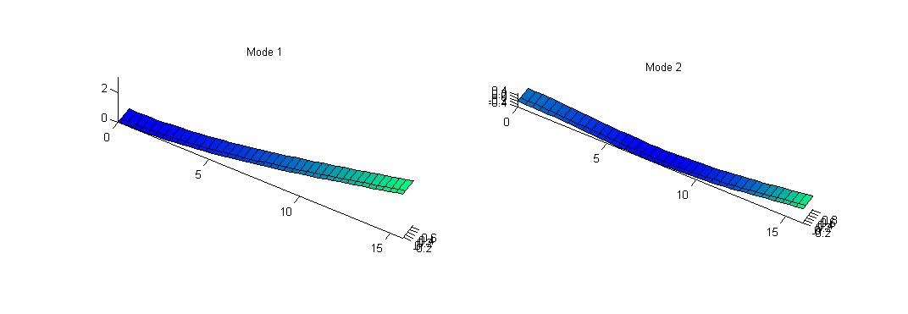
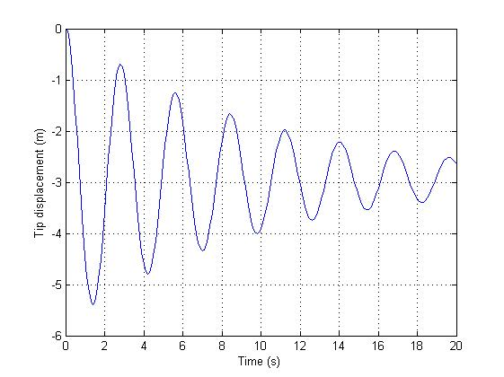
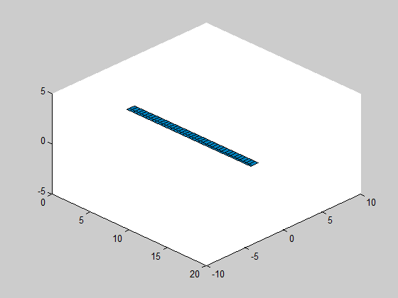

Example 1 - structural dynamics only
==========

This example uses a very flexible beam, proposed by Patil, to perform
some structural dynamics tests. No aerodynamics is taken into account.
The main goal of this example is to introduce how to write a flexible
member and how to use some analysis functions.

Three tasks are performed:
* Modal analysis (from the mass and rigidity matrices, obtained from
the undeformed structure), structural natural frequencies and 
modal shapes are obtained;
* Equilibrium calculation: the structure is subject to gravity. The
equilibrium position is calculated (this uses the nonlinear beam
formulation);
* Simulation of the autonomous response of the beam: the beam is
initially considered undeformed, the dynamic response is then
obtained (which will lead to equilibrium position).

AeroFlex initialization
----------

First, be sure that the 'main' folder is in Matlab Path:

    addpath('..\..\main');    

The, a global variable called softPARAMS must be defined with the
following structure. The parameters are used inside several functions
(equilibrium calculation, dynamic equations, simulation, linearization, etc).
It should be the only global variable.

    global softPARAMS;
    softPARAMS.isIS = 1; %is it International System?
    softPARAMS.isPINNED = 1; % PINNED RIGID BODY DOF
    softPARAMS.vecFREEDEG = [0 0 0 0 0 0]; % type 0 to remove a body state
                                           % degree of freedom [u v w p q r]
    softPARAMS.isGRAV = 1; % include gravity?
    softPARAMS.g = 9.8; % gravity in m/s^2    
    softPARAMS.isITER = 1; % iterative equilibrium determination?
    softPARAMS.numITER = 10; % number of iterations for equilibrium determination
    softPARAMS.modAED = 0; % AERODYNAMIC MODEL: 
                                    %0-Steady;
                                    %1-Quasi-steady;
                                    %2-Quasi-steady with added mass;
                                    %3-Unsteady(Peters);
    softPARAMS.updateStrJac = 1; % Structural Jacobians updates:
                                    % 0 - Never;
                                    % 1 - Only in equilib calculation;
                                    % 2 - Always
    softPARAMS.plota3d = 1; % 3d graphics plot while equilibrium is calculated
	

Defining the flexible member
----------

The definition of the flexible airplane is the more complicated part. We will
show how we do for a single flexible member, without engines or aerodynamic surfaces.
The beam is uniform with constant parameters.
Future examples will deal with more complicated geometries and cases.

Following part calls a function called 'load_structure', which will create an 'airplane'
object:

    numele = 20; %number of elements
    damping = 0.04; %damping coefficient (damping proportional to rigidity matrix)
    ap = load_structure(numele,damping); % this creates a flexible
                                        %airplane object with numele elements
                                        % check the function loadstruct

The 'load_structure' function creates the airplane object. To create this kind
of object, one needs to create before one or more flexible members (which are objects of the
'member' class), one fuselage, one or more 'engines'. In this example, since we don't
have any engines or fuselage, these objects are null. The auxiliary function
'create_flexible_member' is used to (!) create a flexible member.

	function ap = load_structure(numele, damp_ratio)
		% member initialization
		flexible_member = create_flexible_member(numele,damp_ratio);
		
		%set member origin node position and orientation:
		flexible_member(1).seth0([0 -0.0 0 1 0 0 0 1 0 0 0 1]'); 
		update(flexible_member); % initialize displacements for each member node
		fus = []; % no fuselage
		engine1 = []; % no engines
		ap = airplane({flexible_member}, fus, [engine1]);
	end

To create a flexible member, one needs the structural matrices at each structural node,
the inertia matrices, gravity center position (relative to elastic axis) and mass per
unit length. Aerodynamic data is also related with each node (and won't be taken into
account in this example). The function 'create_uniform_structure', which is in the 'main'
directory, creates a wing with constant parameters. Take a look in that file yourself
to verify how a flexible member is created.

	function flexible_member = create_flexible_member(num_elements,damp_ratio)
		

		% beam length
		Length = 16;
		
		% sectional rigidity matrix
		K11 = 1e10; %EA
		K22 = 1e4; %GJ
		K33 = 2e4; %flat bend: EI
		K44 = 4e6; %chord bend: EI
		KG = diag([K11 K22 K33 K44]);
		
		% sectional damping matrix
		CG = damp_ratio*diag([K11 K22 K33 K44]);
		
		% aerodynamic data
		aeroparams = [];
		
		pos_cg = [0 0.3 0]; % position of section gravity center
							% relative to elastic axis
		geometry.a = 0.5;
		geometry.b = 0.5;    
		I22 = 0.0;
		I33 = 0.1;
		I11 = 0.1;
		mcs = 0.75; %mass per unit length (kg/m)
		Inertia = diag([I11 I22 I33]);
		
		% the following function creates a uniform structure automatically; if
		% you need a more complicate wing (with non-uniform parameters, check
		% how the following function creates the structure. you should modify
		% this function to define the correct parameters for each structural
		% node)
		flexible_member = create_uniform_structure(pos_cg, Length, Inertia, mcs, KG, CG, aeroparams, geometry, num_elements);    
		
	end

With the previous steps, the flexible structure is created. Now we can use the
several tools to perform some analysis.
	
Modal analysis
----------

The class 'structural_modes' computes the structural dynamic modes. The following
code computes the first 6 natural frequencies:

    st_modes = structural_modes(ap);
    numerical_freqs = st_modes.frequencies(1:6) % first 6 natural frequencies
    
Numerical results are compared against exact solution using the file '.\exact.m'.

	exact_freqs = sort(exact(4,1,1));
	fprintf('Natural frequencies (in Hz):\n');
	fprintf('| Numerical | Exact \n');
	fprintf('| %.3f | %.3f \n', [numerical_freqs, exact_freqs]')

The following table show the comparison when using 100 elements.
	
|  Mode                   | Numerical | Exact     |
| --------------------- |   --------  |   -------   |
|  number               | freq (Hz) | freq (Hz) |
|1st (vert. bending)  |  0.357     | 0.357     |
|2nd (vert. bending) |  2.237     | 2.237     |
|3rd (torsion)           |  4.941     | 4.941     |
|4th (hor. bending)   |  5.042     | 5.048     |
|5th (vert. bending)  |  6.266     | 6.264     |
|6th (vert. bending)  |  12.284   | 12.274   |

The modal shapes can be ploted using 'plot_mode' method:
    
    %plot results    
    figure('color','w','name','mode 1');
    subplot(1,2,1); st_modes.plot_mode(ap,1); % plot modal shape 1
    view(30,45); axis equal; colormap winter;
    subplot(1,2,2); st_modes.plot_mode(ap,2); % plot modal shape 1
    view(30,45); axis equal; colormap winter;
   
 

Equilibrium computation
----------

The equilibrium is computed using the method 'trimairplane'. It needs the flight conditions,
which are actually useless in this example (since there is no aerodynamics):

    altitude = -1; % meters
    V = -1;           % m/s
    Vwind = 0;        % m/s     
    throttle = 0;
    deltaflap = 0;
    [rb_eq, strain_eq] = trimairplane(ap,V,altitude,Vwind,throttle,deltaflap);

The vector 'strain_eq' gives the strain vector in equilibrium. The following code makes a figure
of the airplane in two different conditions (undeformed and in equilibrium):

    figure('color','w');
    % plot structure without deformation:
    update(ap,strain_eq*0,zeros(size(strain_eq)),zeros(size(strain_eq)),zeros(sum(ap.membNAEDtotal),1));
    plotairplane3d(ap); 
    % plot deformed structure (equilibrium condition):
    update(ap,strain_eq,zeros(size(strain_eq)),zeros(size(strain_eq)),zeros(sum(ap.membNAEDtotal),1));
    plotairplane3d(ap); 
    view(30,45); axis equal; colormap winter;

 

Simulation
----------

The method 'simulation' is used to (!) simulate the system. In this example, we consider as
initial condition zero strain.

	tSIM = input('Simulation time: (seconds)');    
	aerodynamic_surface_pos = 0; % no aerodynamic surfaces!
	engine_position = 0;     % no engine!
	beta0 = [0; 0;0;0;0;0]; % rigid body speeds
	k0 = [0;0;0;0];         % rigid body position/orientation
	strain0 = strain_eq*0;
	% simulation:  
	tic;
	[tNL, strainNL, straindNL, lambdaNL, betaNL, kineticNL] = simulate(ap, [0 tSIM], strain0, beta0, k0, Vwind, @(t)engine_position, @(t)aerodynamic_surface_pos, 'implicit');
	toc;

The following code is used to compute the tip displacement of the wing and make a graphic:

	dt = 0.1;
	[ts, Xs] = changedatarate(tNL,strainNL,dt);
	tip_displacement = zeros(length(ts),1);
	for i = 1:size(ts,1)
		update(ap,Xs(i,:),zeros(size(Xs(i,:))),zeros(size(Xs(i,:))),zeros(sum(ap.membNAEDtotal),1));
		tip_displacement(i) = ap.membros{1}(numele).node3.h(3);
	end
	figure('color','w','name','Wing tip displacement');
	plot(ts,tip_displacement);
	xlabel('Time (s)'); ylabel('Tip displacement (m)');
	grid on;

	
 

The method 'animate' can be used to create an animation, given a time vector and a strain matrix:

	airplanemovie(ap, ts, Xs,dt,'test','gif'); colormap winter;

 
