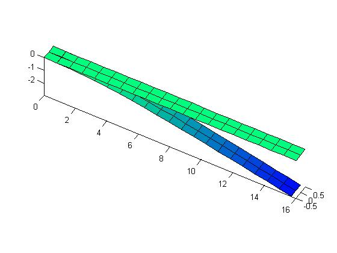
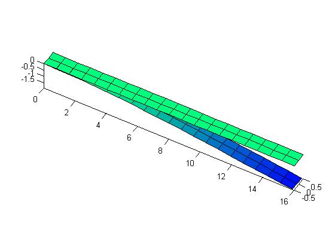
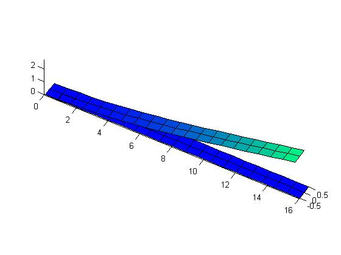
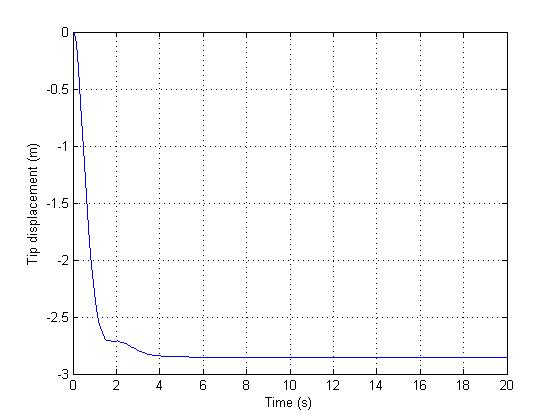
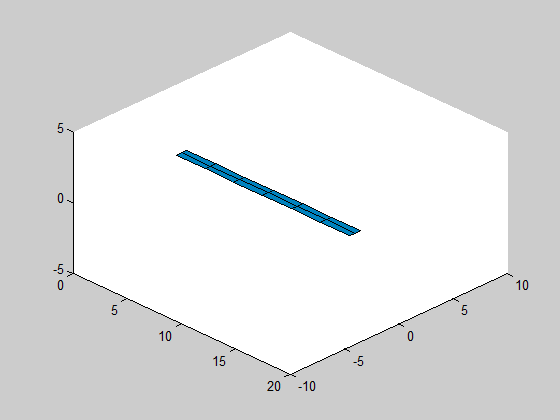
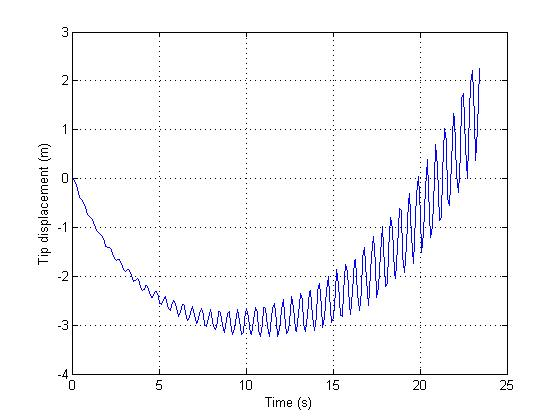

Example 2 - Linear and nonlinear Aeroelasticity
==========

In this example, we use the same structure presented in example 1.
The only difference is that we include an aerodynamic model, allowing
aeroelastic studies.

This initialization is almost unchanged. First, the main folder is included to path:

    addpath('..\..\main');    
	
Then, the general parameters are defined:

    global softPARAMS;
    softPARAMS.isIS = 1; %is it International System?
    softPARAMS.isPINNED = 1; % PINNED RIGID BODY DOF
    softPARAMS.vecFREEDEG = [0 0 0 0 0 0]; % type 0 to remove a body state
                                           % degree of freedom [u v w p q r]
    softPARAMS.isGRAV = 1; % include gravity?
    softPARAMS.g = 9.8; % gravity in m/s^2    
    softPARAMS.isITER = 1; % iterative equilibrium determination?
    softPARAMS.numITER = 10; % number of iterations for equilibrium determination
    softPARAMS.modAED = 3; % AERODYNAMIC MODEL: 
                                    %0-Steady;
                                    %1-Quasi-steady;
                                    %2-Quasi-steady with added mass;
                                    %3-Unsteady(Peters);
    softPARAMS.updateStrJac = 1; % Structural Jacobians updates:
                                    % 0 - Never;
                                    % 1 - Only in equilib calculation;
                                    % 2 - Always
    softPARAMS.plota3d = 1; % 3d graphics plot while equilibrium is calculated

The only difference above is that now we chose the Peters aerodynamic model. This is
the best aerodynamic model implemented in AeroFlex, taking into account unsteady effect of aerodynamics.
(it is also considerably slower, since it adds new dynamic states relative to each structural node).

Then, the airplane object is initialized by calling the function 'load_structure':

    numele = 3; %number of elements
    damping = 0.0001; %damping coefficient (damping proportional to rigidity matrix)
    ap = load_structure(numele,damping); % this creates a flexible
                                        %airplane object with numele elements
                                        % check the function loadstruct

The function 'load_structure' is exactly the same as that from example 1:
										
	function ap = load_structure(numele, damp_ratio)
		% member initialization
		flexible_member = create_flexible_member(numele,damp_ratio);
		
		%set member origin node position and orientation:
		flexible_member(1).seth0([0 -0.0 0 1 0 0 0 1 0 0 0 1]'); 
		update(flexible_member); % initialize displacements for each member node
		fus = []; % no fuselage
		motor1 = []; % no engines
		ap = airplane({flexible_member}, fus, [motor1]);
	end

The difference is on the function 'create_flexible_member', which now includes
the aerodynamic data:

	function flexible_member = create_flexible_member(num_elements,damp_ratio)  
		% beam length
		Length = 16;
		
		% sectional rigidity matrix
		K11 = 1e10; %EA
		K22 = 1e4; %GJ
		K33 = 2e4; %flat bend: EI
		K44 = 4e6; %chord bend: EI
		KG = diag([K11 K22 K33 K44]);
		
		% sectional damping matrix
		CG = damp_ratio*diag([K11 K22 K33 K44]);
		
		% aerodynamic data
		c = 1; % chord
		aeroparams.b = c/2; %semi-chord
		aeroparams.N = 4; %number of lag states (Peter's Unsteady model)
		aeroparams.a = 0.0; % position of aerodynamic center relative to elastic axis
							% relative to elastic axis (in terms of semi-chord)
		aeroparams.alpha0 = 0; % alpha_0 (in radians)
		aeroparams.clalpha = 2*pi; % cl_alpha  lift coeff/rad
		aeroparams.cm0 = 0;        % cm_0      moment coeff
		aeroparams.cd0 = 0.02;     % cd_0
		
		% aerodynamic data for flap/aileron, if exists
		aeroparams.ndelta = 0;   % Identification of the flap (1,2,3,...)
		aeroparams.cldelta = 0;  % cl_delta
		aeroparams.cmdelta = 0;  % cm_delta
				
		% cg position, mass and inertia data
		
		pos_cg = [0 0 0]; % position of section gravity center
							% relative to elastic axis
		geometry.a = 0.0;
		geometry.b = 0.5;    
		I22 = 0.0;
		I33 = 0.1;
		I11 = 0.1;
		mcs = 0.75; %mass per unit length (kg/m)
		Inertia = diag([I11 I22 I33]);
		
		% the following function creates a uniform structure automatically; if
		% you need a more complicate wing (with non-uniform parameters, check
		% how the following function creates the structure. you should modify
		% this function to define the correct parameters for each structural
		% node)
		flexible_member = create_uniform_structure(pos_cg, Length, Inertia, mcs, KG, CG, aeroparams, geometry, num_elements);        
	end

Notice that we now define a structure 'aeroparams', which includes all the aerodynamic
relevant that for each node (cl_alpha, alpha_0, cm_0, cd_0, etc.). In this example, the
wing is uniform. If you are working with a more complicated wing, you need all these parameters
for each node.

Now, the wing is defined! We can use several functions to study this system (like 'trimairplane'
to find the equilibrium, 'linearize' to study the linear behavior, 'simulate', 'flutter_speed', etc.)

The following code uses the function 'trimairplane' to compute the equilibrium condition.
Now, it uses an altitude of 19931.7 meters (used to compute the air density), and a 
wind speed of 10 m/s. The function output 'strain_eq' is a vector with the strain vector
in equilibrium. 

    %%%%%%%%%%%% FINDS EQUILIBRIUM CONDITION %%%%%%%%%%%%%%
    % FLIGHT CONDITIONS -- won't affect the results if there is no aerodynamics
    altitude = 19931.7; % meters
    V = 0;           % rigid body speed m/s
    throttle = 0;
    deltaflap = 0;
    Vwind = 10; % wind speed
    %%%%%% LINEARIZATION OF EQUATIONS OF MOTION %%%%%%%%%%
    [rb_eq, strain_eq] = trimairplane(ap,V,altitude,Vwind,throttle,deltaflap);        

Since this wing has a symmetric airfoil and the elastic axis coincides with
the gravity center, different airspeeds leads to the same equilibrium. The following figure
shows the equilibrium condition (exactly the same as the one from example 1).

For curiosity, we can change the airfoil value of alpha_0 (angle of zero lift), and see how 
it is going to affect the equilibrium position. Here, we've changed it to -5 degrees. The following
figure shows the equilibrium position for a wind speed of 10 m/s:

And the following figure uses the same airfoil, but with a speed of 20 m/s:

Linear aeroelasticity
----------

The method 'linearize', from 'airplane' class, is used to numerically linearize the
equations of motion, allowing to verify local stability. For example:

   throttle = 0; deltaflap = 0;
   betaeq = zeros(6,1);
   keq = [0;0;0;altitude];
    [~, Aaeroelast, ~] = linearize(ap, strain_eq, betaeq, keq, throttle, deltaflap, Vwind_initial);
	
The previous code computes the state (A) matrix, for the aeroelastic system, given the
equilibrium and flight conditions. By analysing the eigenvalues of A, one can check
the system stability and dynamic characteristics. A simple way to find the instability
speed is to gradually increase the speed and look for an eigenvalue of A with positive
real part.

The function 'flutter_speed' can also be used to find instability the minimum instability
speed. The user should give an interval, and the function makes a binary search to
find the instability taking into account a tolerance also specified by the user:

	[flut_speed, flut_eig_val, flut_eig_vec] = flutter_speed(20,35,0.01,ap, strain_eq*0, altitude);

In the previous line, the program looks for the minimum instability speed in the interval
from 20 to 35 m/s, with a tolerance of 0.01 m/s. The strain vector is null, meaning
that linearization is done relative to the undeformed condition. This leads to the classical
linear aeroelasticity results. The function outputs are: flutter speed, eigenvalue of unstable
mode and eigenvector of unstable mode.

The following results are obtained and compared against Patil (1999).

Ref.        |  Flutter speed | Flutter frequency
---------- |-------------  |  -----------------
AeroFlex | 32.56 m/s | 22.55 rad/s
Patil  (1999)  | 32.2 m/s   |  22.6 rad/s

Nonlinear aeroelasticity
---------

The interesting thing is that for this wing the (local) stability characteristics strongly
depends on the equilibrium deformation of the wing. The large structural displacements
change the mass distribution of the wing, and also change the aerodynamic loads directions.
For this reason,  instability can occur at speeds very different from the results obtained
if only a linear structural dynamics model is used.
The following line computes the instability using the equilibrium condition:

	[flut_speed, flut_eig_val, flut_eig_vec] = flutter_speed(20,35,0.01,ap, strain_eq*0, altitude);

Ref.        |  Flutter speed | Flutter frequency
---------- |-------------  |  -----------------
AeroFlex     | 24.03 m/s  | 12.17 rad/s
Patil  (1999)  | 23.4 m/s | 10.3 rad/s

The flutter speed depends also on the angle of attack!! One way to verify it is 
to change the airfoil angle of zero lift, and verify the flutter speed.

Finally, as we did for the structural dynamics example, we can also perform
simulations for this aeroelastic problem, using the 'simulate' method.

Two cases are presented here. First, the time-response for a 10 m/s wind:

Then, for a speed of 26 m/s (above the flutter speed):

