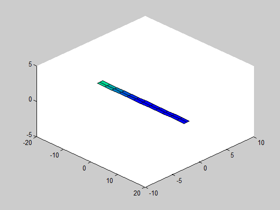

Example 3 - Aileron reversals
==========

This example treats an interesting and possibly dangerous aerolastic phenomenon:
control reversals. Due to wing flexibility, the control surface deflection can
cause an aerodynamic moment that twist the wing, changing the local angle
of attack and causing the opposite force that was supposed to appear due
to the control surface.

Here, we use the same structure presented in previous examples.
We are going to include an aerodynamic control surface (ailerons).
In addition, instead of defining only one flexible member, here we will
define two (one for the left wing, other for the right one).
One rigid body degree of freedom will be allowed (roll rotations, so we can
analyze the wing rolling motion).

Again, the initialization is almost unchanged. First, the main folder is included to path:

    addpath('..\..\main');    
	
Then, the general parameters are defined:

    global softPARAMS;
    softPARAMS.isIS = 1; %is it International System?
    softPARAMS.isPINNED = 1; % PINNED RIGID BODY DOF
    softPARAMS.vecFREEDEG = [0 0 0 0 1 0]; % type 0 to remove a body state
                                           % degree of freedom [u v w p q r]
    softPARAMS.isGRAV = 1; % include gravity?
    softPARAMS.g = 0; % gravity in m/s^2    
    softPARAMS.isITER = 1; % iterative equilibrium determination?
    softPARAMS.numITER = 10; % number of iterations for equilibrium determination
    softPARAMS.modAED = 1; % AERODYNAMIC MODEL: 
                                    %0-Steady;
                                    %1-Quasi-steady;
                                    %2-Quasi-steady with added mass;
                                    %3-Unsteady(Peters);
    softPARAMS.updateStrJac = 0; % Structural Jacobians updates:
                                    % 0 - Never;
                                    % 1 - Only in equilib calculation;
                                    % 2 - Always
    softPARAMS.plota3d = 0; % 3d graphics plot while equilibrium is calculated

The most important difference between this example and previous ones is that
here we changed the 'softPARAMS.vecFREEDEG' vector, allowing a degree of freedom
to roll rotations (Q).

Then, the airplane object is initialized by calling the function 'load_structure':

    numele = 3; %number of elements
    damping = 0.04; %damping coefficient (damping proportional to rigidity matrix)
    ap = load_structure(numele,damping); % this creates a flexible
                                        %airplane object with numele elements
                                        % check the function loadstruct
										
The function 'load_structure' is almost the same as that from previous examples:

	function ap = load_structure(numele, damp_ratio)
		% member initialization
		[right_wing, left_wing] = create_flexible_member(numele,damp_ratio);
		
		%set member origin node position and orientation:
		right_wing(1).seth0([0 -0.0 0 1 0 0 0 1 0 0 0 1]');
		left_wing(1).seth0([0 -0.0 0 1 0 0 0 1 0 0 0 1]');
		update(right_wing); % initialize displacements for each member node
		update(left_wing); % initialize displacements for each member node
		fus = []; % no fuselage
		motor1 = []; % no engines
		ap = airplane({right_wing, left_wing}, fus, [motor1]);
	end

The main difference is that the function 'create_flexible_member' now returns
two flexible structures. One for the left wing, other for the right wing.
Then, both structures should be initialized and put as input on the
initialization of the 'airplane' object.

Let's check the new 'create_flexible_member' function, it has only a few changes, 
in order to create two flexible members:

	function [right_wing, left_wing] = create_flexible_member(num_elements,damp_ratio)   
		% beam length
		Length = 16;
		
		% sectional rigidity matrix
		K11 = 1e10; %EA
		K22 = 1e4; %GJ
		K33 = 2e4; %flat bend: EI
		K44 = 4e6; %chord bend: EI
		KG = 1000*diag([K11 K22 K33 K44]);
		
		% sectional damping matrix
		CG = damp_ratio*diag([K11 K22 K33 K44]);
		
		% aerodynamic data
		c = 1; % chord
		aeroparams.b = c/2; %semi-chord
		aeroparams.N = 0; %number of lag states (Peter's Unsteady model)
		aeroparams.a = 0.0; % position of aerodynamic center relative to elastic axis
							% relative to elastic axis (in terms of semi-chord)
		aeroparams.alpha0 = 0*pi/180; % alpha_0 (in radians)
		aeroparams.clalpha = 2*pi; % cl_alpha  lift coeff/rad
		aeroparams.cm0 = 0;        % cm_0      moment coeff
		aeroparams.cd0 = 0.02;     % cd_0
		
		% aerodynamic data for flap/aileron, if exists
		aeroparams.ndelta = 1;   % Identification of the flap (1,2,3,...)
		aeroparams.cldelta = 0.01; % cl_delta
		aeroparams.cmdelta = -0.1; % cm_delta
				
		% cg position, mass and inertia data
		
		pos_cg = [0 0 0]; % position of section gravity center
							% relative to elastic axis
		geometry.a = 0.0;
		geometry.b = 0.5;    
		I22 = 0.0;
		I33 = 0.1;
		I11 = 0.1;
		mcs = 0.75; %mass per unit length (kg/m)
		Inertia = diag([I11 I22 I33]);
		
		% rotation of initial node with respect to body frame (allow
		% creating uniform beams with a twist, dihedral or sweep angle)
		rot0.dihedral = 0; %angles in RADIANS
		rot0.sweep = 0;
		rot0.twist = 0;
		
		% the following function creates a uniform structure automatically; if
		% you need a more complicate wing (with non-uniform parameters, check
		% how the following function creates the structure. you should modify
		% this function to define the correct parameters for each structural
		% node)
		%right wing
		right_wing = create_uniform_structure(pos_cg, rot0, Length, Inertia, mcs, KG, CG, aeroparams, geometry, num_elements);    
		
		
		% rotation of initial node with respect to body frame (allow
		% creating uniform beams with a twist, dihedral or sweep angle)
		rot0.dihedral = pi; %angles in RADIANS
		rot0.sweep = 0;
		rot0.twist = 0;
		% left wing
		left_wing = create_uniform_structure(pos_cg, rot0, Length, Inertia, mcs, KG, CG, aeroparams, geometry, num_elements);    
		
	end

Notice that the rotation angles for the right wing are all 0. The "dihedral" angle
for the left angle is PI, meaning that it's initial node orientation is rotated around
y axis by 180 degrees.
The other difference is that the previous code defines the aerodynamic characteristics
of the control surfaces. It is supposed that both wings have a uniform aileron, 
along all the wingspan, such that cl_delta = 0.01, and cm_delta = -0.1. 
Only one control is defined (ndelta = 1, so the control input will activate the "ailerons"
of both wings at the same time).
Notice that, since the left-wing has a dihedral of 180 degrees, the 'x' coordinate axis
along this wing is opposed to the 'x' coordinate axis of the right wing. For this reason,
a control deflection will lead to opposite effects in each semi-wing (a positive deflection
means a downward control deflection on the right-wing, and upward deflection on the left-wing).
Thus, antisymmetric deflection of the ailerons are considered (and any deflection will cause
a rolling moment in the airplane).

Once the airplane is defined, we can use usual 'trimairplane' and 'simulate' functions:

    %%%%%%%%%%%% FINDS EQUILIBRIUM CONDITION %%%%%%%%%%%%%%
    % FLIGHT CONDITIONS
    altitude = 19931.7; % meters
    V = 0;           % rigid body speed m/s
    throttle = 0;
    deltaflap = 0;
    Vwind = 10; % wind speed
    %%%%%% LINEARIZATION OF EQUATIONS OF MOTION %%%%%%%%%%
    [rb_eq, strain_eq] = trimairplane(ap,V,altitude,Vwind,throttle,deltaflap);        

    %%%%%%%%%%%%%%%%%%%%%%%%%%%%%%%%%%%%%%%%%%%%%%%%%%%%%%
    %%%%%%%%%%%%%%% NONLINEAR SIMULATION %%%%%%%%%%%%%%%%%
    %%%%%%%%%%%%%%%%%%%%%%%%%%%%%%%%%%%%%%%%%%%%%%%%%%%%%%
    % Initial conditions

    tSIM = input('Simulation time: (seconds)');    
    T=[0 0.1 0.11 100];
    elev=[0 0 1 1 ]*20;
    aerodynamic_surface_pos = @(t) [interp1(T,elev,t)]; % no aerodynamic surfaces!
    engine_position = 0;     % no engine!
    beta0 = [0; 0;0;0;0;0]; % rigid body speeds
    k0 = [0;0;0;20000];         % rigid body position/orientation
    strain0 = strain_eq*0;
    Vwind = 10;
    % simulation:  
    tic;
    [tNL, strainNL, straindNL, lambdaNL, betaNL, kineticNL] = simulate(ap, [0 tSIM], strain0, beta0, k0, Vwind, @(t)engine_position, @(t)aerodynamic_surface_pos, 'implicit');
    toc;

The only difference with respect to previous codes is that here we included
the aileron deflection. The ailerons are moved to 20 degrees position after
0.1 seconds of simulation.

Then, we plot the results:

    dt = 0.1;
    [ts, Xs] = changedatarate(tNL,strainNL,dt);
    [ts, kinetics] = changedatarate(tNL,kineticNL,dt);
    tip_displacement = zeros(length(ts),1);
    for i = 1:length(ts)
        update(ap,Xs(i,:),zeros(size(Xs(i,:))),zeros(size(Xs(i,:))),zeros(sum(ap.membNAEDtotal),1));
        tip_displacement(i) = ap.membros{1}(numele).node3.h(3);
    end
    figure('color','w','name','Wing tip displacement');
    plot(ts,tip_displacement);
    xlabel('Time (s)'); ylabel('Tip displacement (m)');
    grid on;
    
    figure('color','w');
    airplanemovie(ap, ts', Xs,kinetics,dt,'test','gif'); colormap winter;

Here we present two results of simulations. First, we multiply the rigidity matrix by 1000,
in order to simulate the response of a rigid airplane. This lead to the following results:

Then, we present the same response, but for the flexible airplane:

Notice that the flexible airplane presents the opposite rigid body response!
We can actually see the (large) wing twist that appears after aileron deflections.
