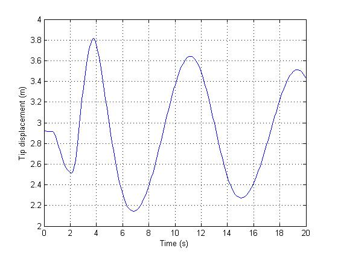
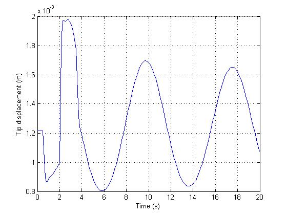
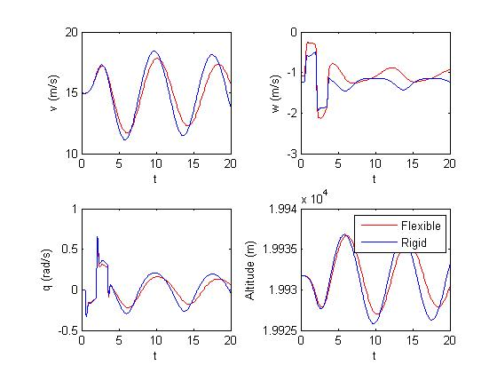
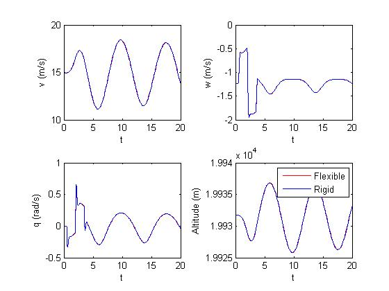
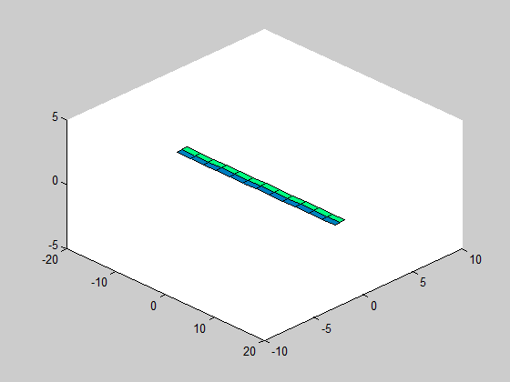

Example 4 - Flight dynamics of flexible flying wing
==========

This example simulates the flight dynamics of a highly flexible flying wing,
with all 6 rigid body degrees of freedom.

The airplane is almost the same the one presented in the previous example.
Its structure was slightly modified to have stable flight dynamics characteristics
by changing the mass distribution (the center of gravity is put ahead of the
aerodynamic center). In addition, a rigid fuselage and one engine is added.

    
	% AeroFlex Main Folder:                              %
    addpath('..\..\main');

    %%%%%%%%%%%%%%%%%%%%%%%%%%%%%%%%%%%%%%%%%%%%%%%%%%%%%%
    % General AeroFlex parameters - MANDATORY PARAMETERS %
    %%%%%%%%%%%%%%%%%%%%%%%%%%%%%%%%%%%%%%%%%%%%%%%%%%%%%%
    global softPARAMS;
    softPARAMS.isIS = 1; %is it International System?
    softPARAMS.isPINNED = 0; % PINNED RIGID BODY DOF
    softPARAMS.vecFREEDEG = [1 1 1 1 1 1]; % type 0 to remove a body state
                                           % degree of freedom [u v w p q r]
    softPARAMS.isGRAV = 1; % include gravity?
    softPARAMS.g = 9.8; % gravity in m/s^2    
    softPARAMS.isITER = 1; % iterative equilibrium determination?
    softPARAMS.numITER = 10; % number of iterations for equilibrium determination
    softPARAMS.modAED = 1; % AERODYNAMIC MODEL: 
                                    %0-Steady;
                                    %1-Quasi-steady;
                                    %2-Quasi-steady with added mass;
                                    %3-Unsteady(Peters);
    softPARAMS.updateStrJac = 1; % Structural Jacobians updates:
                                    % 0 - Never;
                                    % 1 - Only in equilib calculation;
                                    % 2 - Always
    softPARAMS.plota3d = 1; % 3d graphics plot while equilibrium is calculated

Notice that now all rigid body degrees of freedom are allowed, by setting all elements
of 'vecFREEDEG' to 1. 

Then, the airplane is inialized:

    %%%%%%%%%%%% AIRPLANE INITIALIZATION %%%%%%%%%%%%%%%%%
    numele = 3; %number of elements
    damping = 0.04; %damping coefficient (damping proportional to rigidity matrix)
    ap = load_structure(numele,damping); % this creates a flexible
                                        %airplane object with numele elements
                                        % check the function loadstruct

Where 'load_structure' function is the following:

	function ap = load_structure(numele, damp_ratio)
		% member initialization
		[right_wing, left_wing] = create_flexible_member(numele,damp_ratio);
		
		%set member origin node position and orientation:
		right_wing(1).seth0([0 -.3 0 1 0 0 0 1 0 0 0 1]');
		left_wing(1).seth0([0 -.3 0 1 0 0 0 1 0 0 0 1]');
		update(right_wing); % initialize displacements for each member node
		update(left_wing); % initialize displacements for each member node
		fus = RigidFuselage(10, [0 0 0], zeros(3,3));
		engparams.Fmax = 1; engparams.V0 = 1; engparams.rho0 = 1;
		engparams.nv= -1; engparams.nrho = 0; engparams.alphaf = 0;
		engparams.betaf = 0;
		engine1 = engine(1, [1 1 1], engparams); %numEngine, engine position [MEMB,ELM,ND], params

		ap = airplane({right_wing, left_wing}, fus, [engine1]);
	end

Notice that now an engine object was defined. The engine parameters (nv, nrho) are used to define
how the force changes with altitude and speed, as well as its deflection angle to the local node.
The engine is associated with a specific node. The position is written by the vector [1,1,1]:
meaning that the engine is in the first defined member, first element, first node.
A fuselage with mass 10 kg and no rotation inertia is also defined.

Let's check the  function 'create_flexible_member':

	function [right_wing, left_wing] = create_flexible_member(num_elements,damp_ratio)   
		% beam length
		Length = 16;
		
		% sectional rigidity matrix
		K11 = 1e10; %EA
		K22 = 1e4; %GJ
		K33 = 2e4; %flat bend: EI
		K44 = 4e6; %chord bend: EI
		KG = 0.5*diag([K11 K22 K33 K44]);
		
		% sectional damping matrix
		CG = damp_ratio*diag([K11 K22 K33 K44]);
		
		% aerodynamic data
		c = 1; % chord
		aeroparams.b = c/2; %semi-chord
		aeroparams.N = 0; %number of lag states (Peter's Unsteady model)
		aeroparams.a = 0.0; % position of aerodynamic center relative to elastic axis
							% relative to elastic axis (in terms of semi-chord)
		aeroparams.alpha0 = -5*pi/180; % alpha_0 (in radians)
		aeroparams.clalpha = 2*pi; % cl_alpha  lift coeff/rad
		aeroparams.cm0 = 0;        % cm_0      moment coeff
		aeroparams.cd0 = 0.02;     % cd_0
		
		% aerodynamic data for flap/aileron, if exists
		aeroparams.ndelta = 1;   % Identification of the flap (1,2,3,...)
		aeroparams.cldelta = 0.01; % cl_delta
		aeroparams.cmdelta = -0.1; % cm_delta
				
		% cg position, mass and inertia data
		
		pos_cg = [0 0.3 0]; % position of section gravity center
							% relative to elastic axis
		geometry.a = 0.0;
		geometry.b = 0.5;    
		I22 = 0.0;
		I33 = 0.1;
		I11 = 0.1;
		mcs = 0.75; %mass per unit length (kg/m)
		Inertia = diag([I11 I22 I33]);
		
		% rotation of initial node with respect to body frame (allow
		% creating uniform beams with a twist, dihedral or sweep angle)
		rot0.dihedral = 0; %angles in RADIANS
		rot0.sweep = 0;
		rot0.twist = 0;
		
		% the following function creates a uniform structure automatically; if
		% you need a more complicate wing (with non-uniform parameters, check
		% how the following function creates the structure. you should modify
		% this function to define the correct parameters for each structural
		% node)
		%right wing
		right_wing = create_uniform_structure(pos_cg, rot0, Length, Inertia, mcs, KG, CG, aeroparams, geometry, num_elements);    
		
		
		% rotation of initial node with respect to body frame (allow
		% creating uniform beams with a twist, dihedral or sweep angle)
		rot0.dihedral = pi; %angles in RADIANS
		rot0.sweep = 0;
		rot0.twist = 0;
		% left wing
		
		aeroparams.alpha0 = 5*pi/180; % alpha_0 (in radians)
		aeroparams.cldelta = -0.01; % cl_delta
		aeroparams.cmdelta = 0.1; % cm_delta
		left_wing = create_uniform_structure(pos_cg, rot0, Length, Inertia, mcs, KG, CG, aeroparams, geometry, num_elements);    
		
	end

A few differences with respect to previous example:
* The center of gravity is moved 0.3 meters forward: pos_cg = [0 0.3 0];
* The angle of attack of zero lift is changed to -5 degrees: 	aeroparams.alpha0 = -5*pi/180;
(+ 5 degrees for the left wing, due to sign convention)
* The control surface now considers symmetric aileron deflections. For this reason, 
the values of 'cldelta' and 'cmdelta' are opposed for each semi-wing (again, due to
sign convention - since the direction of local 'x axis' is from the wing root to tip).

Now that the airplane is defined, we can use usual 'trimairplane' and 'simulate' functions:

    %%%%%%%%%%%% FINDS EQUILIBRIUM CONDITION %%%%%%%%%%%%%%
    % FLIGHT CONDITIONS
    altitude = 19931.7; % meters
    V = 15;           % rigid body speed m/s
    throttle = 0;
    deltaflap = 0;
    Vwind = 0; % wind speed
    [rb_eq, strain_eq] = trimairplane(ap,V,altitude,Vwind,throttle,deltaflap);                   

    theta = rb_eq(1);
    deltaflap = rb_eq(2);
    engine_position = rb_eq(3);

The 'trimairplane' finds the rigid body and strain equilibrium conditions, considering a flight
at 20 km altitude, at 15 m/s. The rb_eq is a vector with 'theta' (pitch angle), the control
surface position and the engine value at equilibrium.

Now we simulate the airplane, starting from equilibrium conditions. A double input is applied
to the elevons.

    tSIM = input('Simulation time: (seconds)');    
    T=[0.00 0.49 0.50 1.99 2.00 3.49 3.5 100];
    elev=[0 0 1 1 -1 -1 0 0]/5;
    aerodynamic_surface_pos = @(t) (deltaflap+interp1(T,elev,t));
    beta0 = [0; V*cos(theta);-V*sin(theta);0;0;0]; % rigid body speeds
    k0 = [theta;0;0;altitude];         % rigid body position/orientation
    strain0 = strain_eq;
    Vwind = 0;
    % simulation:  
    [tNL, strainNL, straindNL, lambdaNL, betaNL, kineticNL] = simulate(ap, [0 tSIM], strain0, beta0, k0, Vwind, @(t)engine_position, aerodynamic_surface_pos, 'implicit');

Then, several results are plotted: tip deflection, 

    dt = 0.1;
    [ts, Xs] = changedatarate(tNL,strainNL,dt);
    [ts, kinetics] = changedatarate(tNL,kineticNL,dt);
    tip_displacement = zeros(length(ts),1);
    for i = 1:length(ts)
        update(ap,Xs(i,:),zeros(size(Xs(i,:))),zeros(size(Xs(i,:))),zeros(sum(ap.membNAEDtotal),1));
        tip_displacement(i) = ap.membros{1}(numele).node3.h(3);
    end
    figure('color','w','name','Wing tip displacement');
    plot(ts,tip_displacement);
    xlabel('Time (s)'); ylabel('Tip displacement (m)');
    grid on;
        
    longfig = figure('color','w');
    subplot(2,2,1); plot(tNL,betaNL(:,2),'r'); xlabel('t'); ylabel('v (m/s)'); hold all;%velocidade eixo y
    subplot(2,2,2); plot(tNL,betaNL(:,3),'r'); xlabel('t'); ylabel('w (m/s)'); hold all;%velocidade eixo z
    subplot(2,2,3); plot(tNL,betaNL(:,4),'r'); xlabel('t'); ylabel('q (rad/s)');hold all;%q
    subplot(2,2,4); plot(tNL,kineticNL(:,4),'r'); xlabel('t'); ylabel('Altitude (m)');hold all; %H
    deltaalfa = 0; deltau = 0; deltav = 0; deltaw = 0;
    dinamicarigida(V,altitude,longfig, tSIM, deltav, deltaw, deltaalfa,@(t)0, @(t)interp1(T,elev,t));

The last line uses the file 'dinamicarigid' to simulate the rigid body flight dynamic equations only.
We made two simulations, one with the flexible airplane presented above. Othe by multiplying
the rigidity matrix by 1000 (leading to an almost rigid airplane). See the tip deflection for
the highly flexible airplane:

and for the almost rigid airplane:

We can also verify the difference between the rigid body dynamics of the flexible and using
classical rigid body flight dynamics. 

and for the almost rigid airplane:

Notice that for the "almost flexible" airplane (rigidity matrix multiplied by 1000), the simulation
almost coincides with the rigid body simulation.

Finally, an animation can be done from the simulation results:

    airplanemovie(ap, ts', Xs,kinetics,dt,'test','gif'); colormap winter;

Again, here we present two results of simulations. For the "almost rigid" airplane:

Then, we present the same response, but for the highly flexible airplane:

